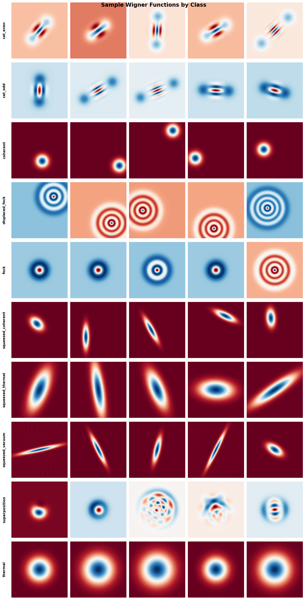

# CNN Classifier for Wigner Functions

A convolutional neural network for classifying quantum states based on their Wigner function representations.

## Overview

This project implements a deep CNN to classify 10 different quantum state types from their Wigner function visualizations. The model achieves high accuracy in distinguishing between various quantum states commonly used in quantum optics and information.

### Classified States

- **Cat States** (even/odd)
- **Coherent States**
- **Displaced Fock States**
- **Fock States**
- **Squeezed States** (coherent/thermal/vacuum)
- **Superposition States**
- **Thermal States**



## Model Architecture

The classifier uses a 4-layer CNN with batch normalization and dropout:

- **Input**: 128×128 grayscale images
- **Architecture**: 4 convolutional blocks (32→64→128→256 filters)
- **Regularization**: Dropout (0.2-0.4), Batch Normalization
- **Output**: 10 classes
- **Parameters**: ~1.37M trainable parameters

## Dataset

Generated using [QuTiP](https://qutip.org/) (Quantum Toolbox in Python):
- 10,000 total images (1,000 per class)
- 128×128 resolution
- Grayscale Wigner function representations

## Installation

```bash
# Clone repository
git clone https://github.com/yourusername/CNN-Wigner-functions-classifier.git
cd CNN-Wigner-functions-classifier

# Create virtual environment
python -m venv cnn
source cnn/bin/activate  # On Windows: cnn\Scripts\activate

# Install dependencies
pip install torch torchvision numpy matplotlib pillow pandas scikit-learn tqdm
```

## Usage

### Training

```python
from cnn_structure import WignerClassifier, WignerTrainer, create_dataloaders

# Load data
train_loader, val_loader, dataset = create_dataloaders(
    data_path="quantum_images_png",
    batch_size=32,
    val_split=0.2
)

# Initialize and train
model = WignerClassifier(num_classes=10)
trainer = WignerTrainer(model)
trainer.fit(train_loader, val_loader, epochs=50, lr=0.001)
```

### Inference

```python
# Load trained model
checkpoint = torch.load('best_model.pth')
model.load_state_dict(checkpoint['model_state_dict'])

# Predict
preds, labels, probs = trainer.predict(val_loader)
```

## Data Format

Two loading options supported:

1. **Folder structure**: `root_dir/class_name/*.png`
2. **CSV index**: CSV with `image_path,label` columns

## Results

The model typically achieves >95% validation accuracy after training with early stopping and learning rate scheduling.

## License

Licensed under the [Apache License 2.0](LICENSE)

## Acknowledgments

Quantum state data generated with [QuTiP](https://qutip.org/)
